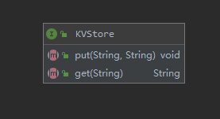

# Vance APIs

## Connector Entrance

The cdk provides an easy way to launch your connector application:

```java
public class Entrance {
    public static void main(String[] args) {
        VanceApplication.run(MyConnector.class);
    }
}
```

`MyConnector` is the implementation of either a [Sink or Source](#connector-interface) interface.

## Connector Interface

The `Sink` and `Source` Interfaces reflect the [Sink and Source Concepts][concept] respectively.


You have to implement the corresponding interface when developing a connector.
```java
public interface Sink {
    // write your codes in this start() method
    void start() throws Exception;
}
```

```java
public interface Source extends Sink{
    // A source connector must implement this method to specify an Adapter to tell how the connector will
    // transform incoming data into a CloudEvent.
    Adapter getAdapter();
}
```

## Adapter Interface

`Adapter` is an abstract concept used to demonstrate how the Source connector will transform incoming data into
a CloudEvent.

Currently, your concrete Adapter MUST implement either the `Adapter1`, or the `Adapter2` interface.


Choose an appropriate `Adapter` interface to implement based on the number of your incoming data you need to generate a
CloudEvent.

For example, if the incoming data is a pure String, you should choose `Adapter1`, and use `String` as its generic type.

```java
public class StringAdapter implements Adapter1<String> {
    private static final CloudEventBuilder template = CloudEventBuilder.v1();
    @Override
    public CloudEvent adapt(String originalData) {
        template.withId(UUID.randomUUID().toString());
        URI uri = URI.create("sample-source");
        template.withSource(uri);
        template.withType("http");
        template.withDataContentType("application/json");
        template.withTime(OffsetDateTime.now());

        JsonObject data = new JsonObject();
        data.put("mydata",originalData);
        
        template.withData(data.toBuffer().getBytes());

        return template.build();
    }
}
```

If the incoming data is an HTTP request and, you need both headers and the body to generate a CloudEvent, 
then you should choose `Adapter2`, with `HttpServerRequest` and `Buffer` as its generic type, to use.

```java
class HttpAdapter implements Adapter2<HttpServerRequest,Buffer> {
    private static final CloudEventBuilder template = CloudEventBuilder.v1();
    @Override
    public CloudEvent adapt(HttpServerRequest req, Buffer buffer) {
        template.withId(UUID.randomUUID().toString());
        URI uri = URI.create("vance-http-source");
        template.withSource(uri);
        template.withType("http");
        template.withDataContentType("application/json");
        template.withTime(OffsetDateTime.now());

        JsonObject data = new JsonObject();
        JsonObject headers = new JsonObject();
        req.headers().forEach((m)-> headers.put(m.getKey(),m.getValue()));
        data.put("headers",headers);
        JsonObject body = buffer.toJsonObject();
        data.put("body",body);
        
        template.withData(data.toBuffer().getBytes());

        return template.build();
    }
}
```
## Config

### ConfigUtil

`ConfigUtil` is a class which provides static methods to load user-specific configs. The following methods are supported by the `ConfigUtil.class`:
| Number         | Method          | Description |
|:-------------|:------------------|:------|
| 1 | public static String getString(String key) | Get a config value according to a specific key  |
| 2 | public static List<String> getStringArray(String key)   | Get a list of configs according to a specific key |
| 3 | public static String getEnvOrConfigOrDefault(String name) | Same as ConfigUtil.getString(String). This method retrieves data from env and config first.If this method cannot find value from above positions, it will try to get a default value in the SDK.  |
| 4 | public static String getConfigPath()   | Get config-path, it could either be a user-set env or default config-path value |
| 5 |     public static String getVanceSink() | Get the sink of vance, its default value is v_target value  |
| 6 | public static String getPort()   | Get the port the process needs to listen to. |
| 7 | public static String getKVStore() | Get the name of KVStore.                    |

### SecretUtil

`SecretUtil` provides static methods to load secrets of users for authentication or encryption. The secrets need to be encrypted and stored in the secret.json file. The following methods are supported by the `SecretUtil.class`:

| Number         | Method          | Description |
|:-------------|:------------------|:------|
| 1 | public static String getString(String key) | Get decoded value of users' secrets according to a specific key.  |

## KVStore

`KVStore` interface provides Key-Value Storage implementation in Vance Connectors. The cdk-java now supported two modes of KV Storage implementation include `EtcdKVStore` and `FileKVStore`. `EtcdKVStore` uses etcd to storage KV data. And if you don't want to use etcd, you can just store the data in a local file by using `FileKVStore`. 



We can use `KVStoreFactory.class` to create KVStore of etcd type or file type. The method provided to create KVStore is as follows:

| Number         | Method          | Description |
|:-------------|:------------------|:------|
| 1 | public static KVStore createKVStore() | A factory method to build KVStore of different types  |

This method loads the KVStore type name from config.json in which you configure the `v_store` attribute like `"v_store": "file"` or `"v_store": "etcd"`. If the `v_store` attribute is not configured in config.json, `KVStoreFactory.class` will use the default `FileKVStore` mode to realize KV Storage.
While using `FileKVStore` mode, you should set `v_store_file` attribute in config.json. And when you use `EtcdKVStore` mode, you should set `etcd_url` attribute in config.json. The `v_store_file` indicates the path name of the storage file, while the `etcd_url` indicates the endpoints of etcd. Here is an example of configuration of the two attributes:
``` Json 
"v_store_file": "/vance/data/data.file"
"etcd_url": "http://localhost:2379"
``` 
The following code shows the application  of `KVStore`:
``` java
public static void main(String[] args) {
        KVStore kv = KVStoreFactory.createKVStore();
        kv.put("abc","ccc");
        System.out.println(kv.get("abc"));
        kv.put("abc","ddd");
        System.out.println(kv.get("abc"));
        kv.put("abc","eee");
        System.out.println(kv.get("abc"));
    }
```

## JsonMapper
JsonMapper provides the `public static JsonObject wrapCloudEvent(CloudEvent event)` method to wrap data of CloudEvents
into a JsonObject.

## GenericFileUtil
Methods provided by GenericFileUtil:
```java
public static String readResource(String resourceName);
public static String readFile(String fileName);
```
Both methods provide reading of files and resources and return results in String format.

## URITool
Methods provided by URITool:
```java
public static URI getURI(String uriStr);
public static String getHost(URI uri);
public static boolean isIP(String uri);
```
1. The `getURI` method will wrap a uri name in String format into a URI format.
2. The `getHost` method will resolve the host ip from a uri.
3. The `isIP` method will judge whether a String is an IP address.

[concept]: https://github.com/linkall-labs/vance-docs/blob/main/docs/concept.md